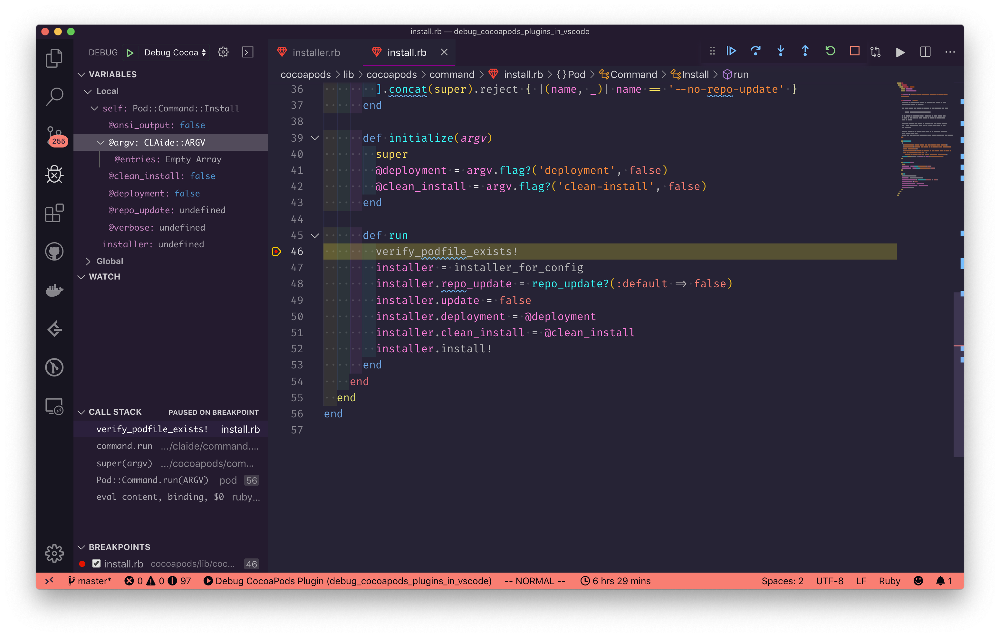
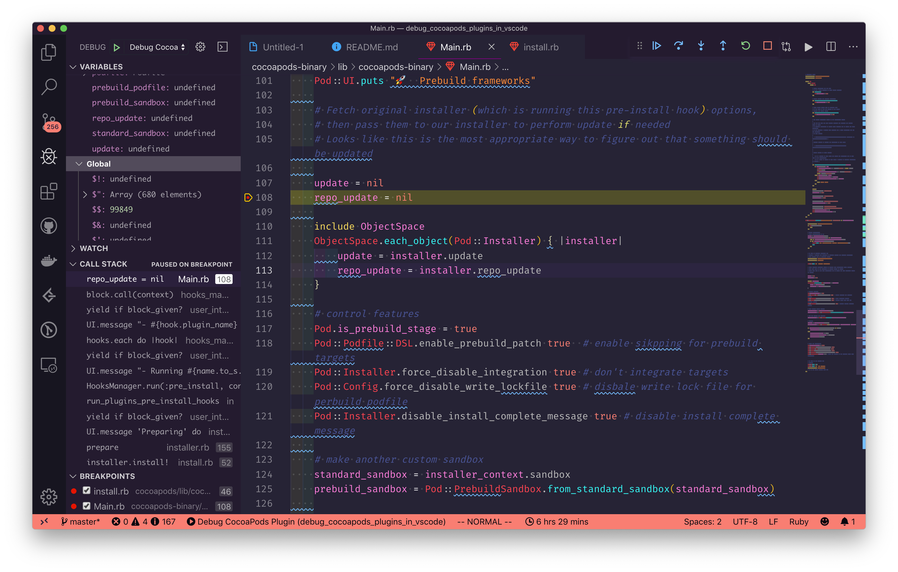

# Debug CocoaPods & Plugins in VSCode

[中文版本点这里](./duwo.md)

[使用 VSCode debug CocoaPods 和插件源码](https://zxy.vercel.app/debug-cocoapods-with-vscode)





- [Debug CocoaPods & Plugins in VSCode](#debug-cocoapods--plugins-in-vscode)
  - [Pre-requirements](#pre-requirements)
    - [Install Debug Gems](#install-debug-gems)
    - [Install VSCode Ruby Plugin](#install-vscode-ruby-plugin)
  - [Debug With bundler](#debug-with-bundler)
  - [Debug without bundler](#debug-without-bundler)
    - [Debug CocoaPods](#debug-cocoapods)
    - [Debug CocoaPods & plugin](#debug-cocoapods--plugin)
    - [Example of debugging CocoaPods & plugin](#example-of-debugging-cocoapods--plugin)

## Pre-requirements

### Install Debug Gems

```sh
gem install ruby-debug-ide
gem install debase
```

### Install VSCode Ruby Plugin

[Ruby](https://marketplace.visualstudio.com/items?itemName=rebornix.Ruby)

## Debug With bundler

- Create a `Gemfile` in project root and add the following content to it

```rb
gem 'cocoapods', path: 'path/to/cocoapods/'
gem 'cocoapods-binary', path: 'path/to/cocoapods-binary/'
gem 'ruby-debug-ide'
gem 'debase'
```

- run `bundle install`
- Create `.vscode/launch.json` in project root

```json
{
  "configurations": [{
      "name": "Debug CocoaPods Plugin with Bundler",
      "showDebuggerOutput": true,
      "type": "Ruby",
      "request": "launch",
      "useBundler": true,
      "cwd": "${workspaceRoot}/Testing",
      "program": "${workspaceRoot}/cocoapods/bin/pod",
      "args": ["install"]
    }
}
```

- Add some breakpoint within VSCode
- Press F5 or hit menu `Debug - Start Debugging`


## Debug without bundler

> Don't waste your time! Use bundler now!

### Debug CocoaPods

- Clone [CocoaPods](https://github.com/CocoaPods/CocoaPods)
```sh
git clone https://github.com/CocoaPods/CocoaPods.git
```

- Checkout cloned repo to match the version you have installed on your laptop

```sh
git checkout `pod --version`
```

- Create `.vscode/launch.json` in CocoaPods' root folder

```json
{
  "configurations": [{
    "name": "Debug CocoaPods Plugin",
    "showDebuggerOutput": true,
    "type": "Ruby",
    "request": "launch",
    "cwd": "path/to/podfile/dir", // where the `pod` command execute (the folder should contain a `Podfile`)
    "program": "${workspaceRoot}/bin/pod",
    "args": ["install"] // `pod` command arguments
  }]
}
```
- Comment `bin/pod:L27 (# require 'bundler/setup')` 
- Add some breakpoint within VSCode
- Press F5 or hit menu `Debug - Start Debugging`

### Debug CocoaPods & plugin

- Create a new folder, all actions below are under this folder
- Clone & checkout CocoaPods source code
- Clone or create a CocoaPods plugin
- Copy `.vscode` to this folder
- Make some changes in `.vscode/launch.json`
  - `cwd`: where the `pod` command execute (the folder should contain a `Podfile`) 
  - `pluginPath`: path to the plugin
  - `args`: `pod` command arguments
- Change `cocoapods/bin/pod:L27` 
  - From `require 'bundler/setup` to `require_relative '../../.vscode/plugin_patch'`, just like [this](https://github.com/X140Yu/debug_cocoapods_plugins_in_vscode/blob/1a79aa6db45b67218e84044d8c3dce665cf92658/cocoapods/bin/pod#L27:L28)
- Add some breakpoint within VSCode
- Press F5 or hit menu `Debug - Start Debugging` 

### Example of debugging CocoaPods & plugin

> The CocoaPods version in this repository is `1.8.0.beta.1`, incase some version incompatible issue with CocoaPods-Core or other gems, you should install this version's CocoaPods in your Mac too

- Clone this repository
- Open it with VSCode
- Add a breakpoint somewhere you like to explore
  - eg. `cocoapods/lib/cocoapods/command/install.rb:L46`
  - eg. `cocoapods-binary/lib/cocoapods-binary/Main.rb:L101`
- Press F5 or hit menu `Debug - Start Debugging`
- All set 🌸


---

If you have any question, don't hesitate to fire a issue 😉

Appreciate a 🌟 if you like it. 
